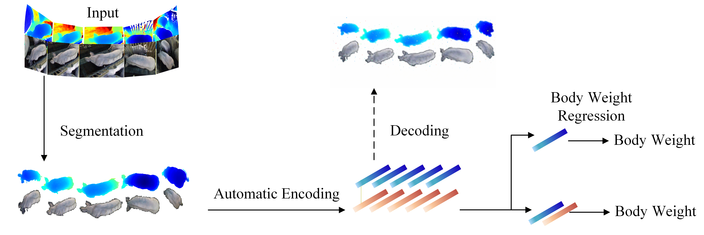

# Handheld RGB-D-based weight estimation of finishing pigs in commercial pig houses

'''Algorithm Flow

Reproduction steps
1. tools/a_Generatetrainingandtestsetdirectories
2. tools/b_seg_rgb_pointcloud
3. train.py trainaepointcloud
4. train_weight_regressor_flex1_r2_bestonly.py trainregressors

data
Download link(rgb and pointcloud):
